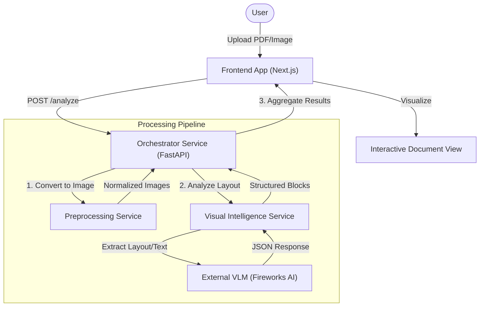

# System Architecture

DocIntel Pro is built on a **Cloud-Native Microservices Architecture** designed for high throughput, scalability, and loose coupling.

## High-Level Diagram



## Component Breakdown

### 1. Frontend (Next.js)
*   **Purpose**: User interface for file upload and results visualization.
*   **Key Features**:
    *   **Drag-and-Drop Upload**: Handles both single images and multi-page PDFs.
    *   **Document Visualizer**: Renders document pages as images with overlay bounding boxes for detected elements (Text, Tables, Figures).
    *   **Responsive Design**: Built with Tailwind CSS and Shadcn/UI for a clean, modern look.
    *   **Polling/State Management**: Handles asynchronous analysis status updates (currently synchronous via request/response but extensible to polling).

### 2. Orchestrator Service (FastAPI)
*   **Purpose**: Central workflow engine and API Gateway.
*   **Responsibilities**:
    *   **Job Management**: Assigns unique Job IDs to each upload.
    *   **Routing**: Decides which services to call based on file type (e.g., send PDF to Preprocessing first).
    *   **Parallelism**: Uses `asyncio` to process multiple pages concurrently.
    *   **Error Handling**: Implements exponential backoff and retries for downstream services.
    *   **Aggregation**: Combines partial results from multiple pages into a single `AnalysisResponse`.

### 3. Preprocessing Service (FastAPI)
*   **Purpose**: CPU-intensive image manipulation.
*   **Capabilities**:
    *   **PDF to Image**: Converts PDF pages to high-resolution PNG images using `pdf2image` (Poppler).
    *   **Normalization**: Standardizes image format, resolution, and orientation (future: deskewing).
    *   **Denoising**: Removes noise artifacts to improve downstream OCR accuracy.

### 4. Visual Intelligence Service (FastAPI)
*   **Purpose**: GPU-accelerated (or API-driven) document understanding.
*   **Implementation**:
    *   **Model**: Interfaces with **Qwen2-VL** hosted on **Fireworks AI**. This model is state-of-the-art for visual document understanding.
    *   **Layout Analysis**: Detects regions like `Header`, `Footer`, `Table`, `Figure`, and `Text`.
    *   **Unified OCR**: Performs Optical Character Recognition on text regions directly within the VLM pass, ensuring text is associated with its visual block.
    *   **Coordinate Normalization**: Converts model-specific bounding box formats (0-1000) to absolute pixel coordinates for the frontend.

## Data Models

### Block
The fundamental unit of analysis.
```json
{
  "type": "text | table | figure | header ...",
  "confidence": 0.98,
  "bounding_box": { "x1": 100, "y1": 100, "x2": 500, "y2": 200 },
  "attributes": {
    "text": "Extracted content...",
    "page_number": 1
  }
}
```

### Page
Represents a single page of a document.
```json
{
  "page_number": 1,
  "dimension": { "width": 1000, "height": 1400 },
  "blocks": [ ... ],
  "base64_image": "data:image/png;base64,..."
}
```

## Security & Scalability
*   **Stateless Services**: All services are stateless and can be horizontally scaled behind a load balancer.
*   **Secure Communication**: Services communicate via HTTP (REST). In production, this would be secured via internal network policies or mTLS.
*   **API Key Management**: External API keys (Fireworks AI) are managed via environment variables and never hardcoded.
