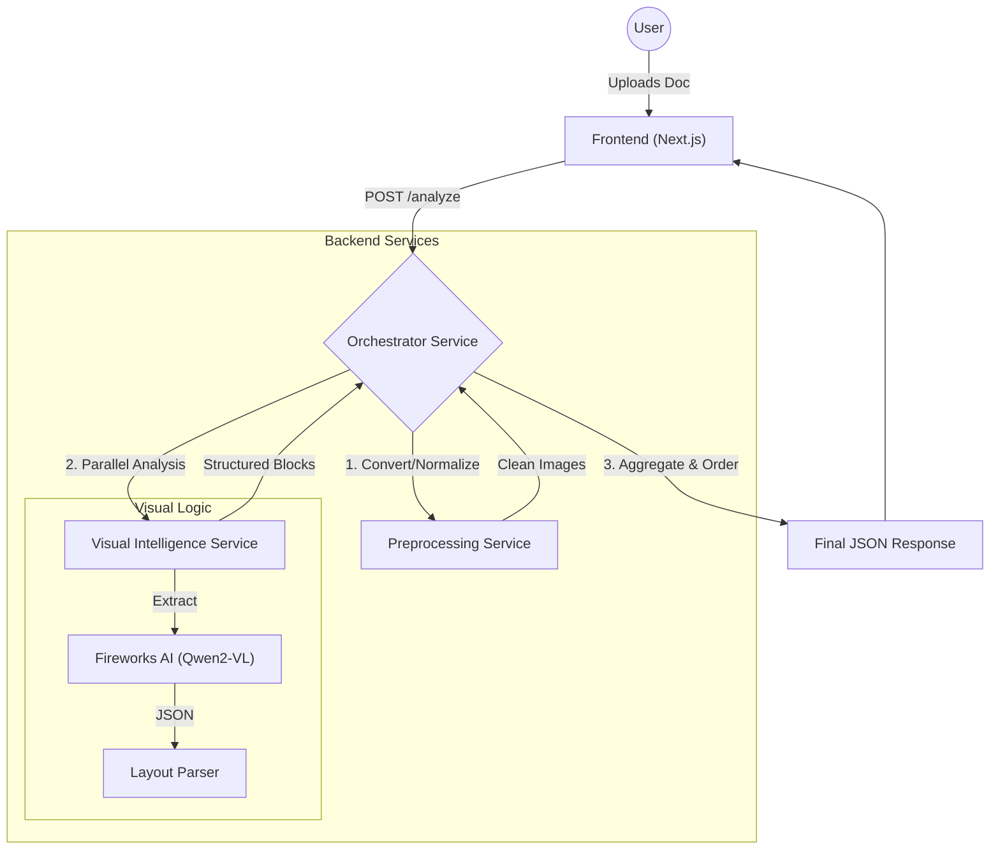

# 📄 DocIntel Pro: Agentic Document Analysis Engine


**DocIntel Pro** is a high-throughput, **Agentic Document Processing System** designed to transform unstructured documents (PDFs, Images) into structured, actionable intelligence. It leverages state-of-the-art **Visual Language Models (VLMs)** like **Qwen2-VL** (via Fireworks AI) to perform unified layout analysis, OCR, and semantic understanding in a single pass.

> **"Visual First, Text Second."** Unlike traditional OCR pipelines that lose context, DocIntel Pro understands the visual structure of your document—charts, tables, seals, and handwriting—preserving the semantic meaning of your data.

---

## 🏗️ System Architecture

The system follows a **Cloud-Native Microservices Architecture**, orchestrated by a central workflow engine.

### High-Level Data Flow



### Microservices Breakdown

| Service | Port | Tech Stack | Responsibilities |
| :--- | :--- | :--- | :--- |
| **Frontend** | `:3000` | Next.js, React, Tailwind, Shadcn/UI | Modern, responsive UI for uploading documents and visualizing results with bounding boxes. |
| **Orchestrator** | `:8000` | FastAPI, Python, AsyncIO | Workflow engine. Handles file intake, routing to workers, error handling, and results aggregation. |
| **Preprocessing** | `:8001` | FastAPI, OpenCV, pdf2image | CPU-bound image operations: PDF-to-Image conversion, Denoising, Deskewing, Normalization. |
| **Visual Intelligence** | `:8002` | FastAPI, Fireworks AI SDK | GPU-accelerated inference. Interfaces with VLMs to detect layout, extract text, and recognize tables/figures in one step. |

---

## 🚀 Key Features

*   **Unified Analysis**: Uses Vision-Language Models to perform Layout Analysis and OCR simultaneously.
*   **Multi-Page Support**: Handles multi-page PDFs with parallel processing for high performance.
*   **Visual Grounding**: Returns precise bounding boxes for every detected element (Text, Tables, Figures).
*   **Resilient Architecture**: Exponential backoff and retries for external API calls; isolated services preventing cascade failures.
*   **Modern UI**: A beautiful, responsive interface with real-time feedback and visual overlays.

---

## 🛠️ Getting Started

### Prerequisites

*   **Python 3.10+** (Recommended: Use Conda)
*   **Node.js 18+** & `npm` / `bun`
*   **PopplerUtils** (Required for PDF processing)
    *   Ubuntu: `sudo apt-get install poppler-utils`
    *   MacOS: `brew install poppler`
*   **Fireworks AI API Key**: Get one at [fireworks.ai](https://fireworks.ai/)

### 1. Environment Setup

Clone the repository and create a virtual environment:

```bash
git clone https://github.com/yourusername/docintel-pro.git
cd docintel-pro

# Create Conda Environment
conda create -n doc_analysis_env python=3.10 -y
conda activate doc_analysis_env

# Install Backend Dependencies
pip install -r preprocessing_service/requirements.txt
pip install -r visual_service/requirements.txt
pip install -r orchestrator/requirements.txt (if present, or install commonly used libs)
# Note: Ensure you have standard libs: fastapi, uvicorn, python-multipart, httpx, opencv-python-headless, pdf2image, fireworks-ai
```

### 2. Configuration

Create a `.env` file in the root directory (or ensure services indicate where to look).
For the Visual Service, export your API Key:

```bash
export FIREWORKS_API_KEY="your_api_key_here"
```

### 3. Run the Services

It is recommended to run each service in a separate terminal window or use a process manager (like Supervisord or Docker Compose - coming soon).

**Terminal 1: Preprocessing Service**
```bash
uvicorn preprocessing_service.main:app --port 8001 --reload
```

**Terminal 2: Visual Intelligence Service**
```bash
uvicorn visual_service.main:app --port 8002 --reload
```

**Terminal 3: Orchestrator**
```bash
uvicorn orchestrator.main:app --port 8000 --reload
```

**Terminal 4: Frontend**
```bash
cd frontend
npm install
npm run dev
```

The UI will be available at `http://localhost:3000`.

---

## 🔮 Roadmap

*   [ ] **Docker Compose**: One-click startup for the entire stack.
*   [ ] **Database Integration**: Persist analysis results (PostgreSQL/MongoDB).
*   [ ] **Streaming Responses**: Real-time progress updates for long documents.
*   [ ] **Local Inference**: Support for local VLMs (e.g., Llava, BakLLaVA) via Ollama.

---

## 🤝 Contributing

Contributions are welcome! Please fork the repository and submit a Pull Request.

## 📄 License

This project is licensed under the MIT License.
